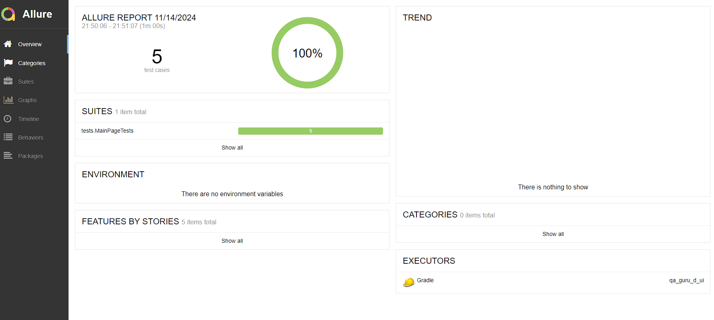
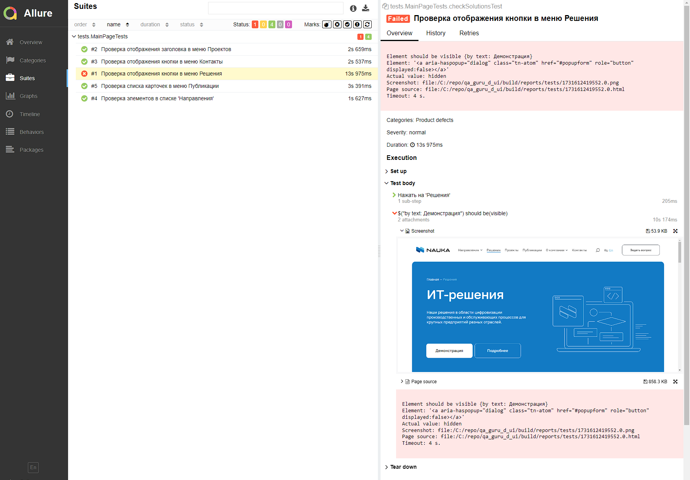
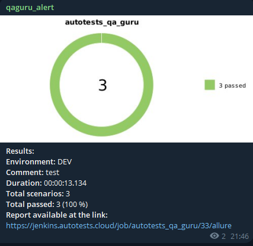

# Проект по автоматизации тестовых сценариев для сайта компании Наука
## :scroll: Содержание:

- [Используемый стек](#computer-используемый-стек)
- [Запуск автотестов](#arrow_forward-запуск-автотестов)
- [Пример Allure-отчета](#arrow_forward-пример-отчета-allure)
- [Уведомления в Telegram](#Уведомления-в-Telegram)


## :computer: Используемый стек

<p align="center"> 
Java
Selenide
Selenoid
Allure Report
Allure TestOps
Gradle
JUnit5
Jenkins
Telegram

</p>

В данном проекте находятся UI автотесты на сайт компании Наука. Для создания тестов использовалась Java 17 и сборщик Gradle.
Тесты можно запускать удаленно с помощью в Jenkins с формированием Allure-отчета и получить результаты в Telegram с помощью бота.


## :arrow_forward: Запуск автотестов

### Запуск тестов из терминала
```
gradle clean test -Denv=remote - удаленно через Selenoid
gradle clean test -Denv=local - локально у себя на устройстве
```

## :arrow_forward: Пример отчета Allure

### Результат выполнения автотеста

<p align="center">


</p>


### Уведомления в Telegram


<p align="center">

</p>

